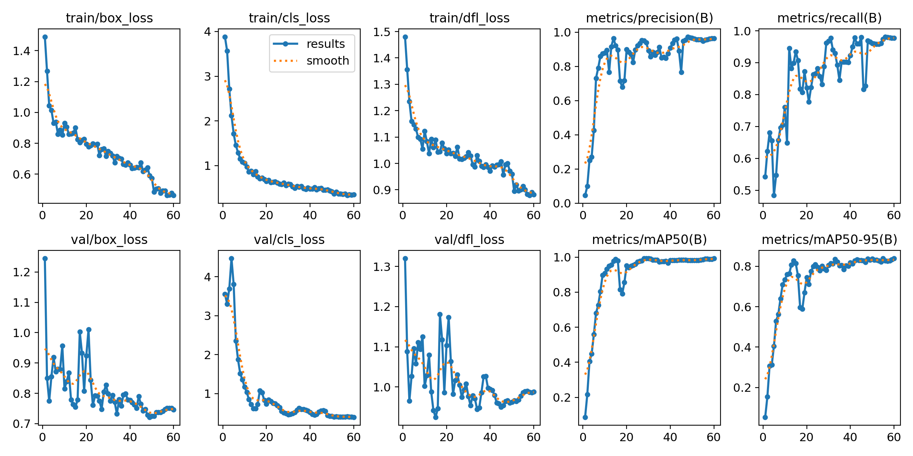
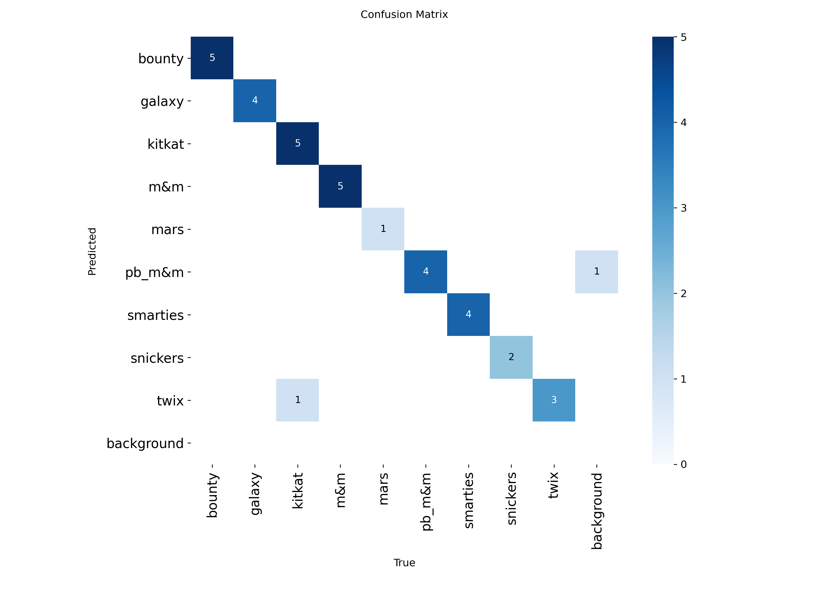

# Smart Checkout

A real-time product detection and pricing system powered by a custom-trained YOLOv11 model. Point a camera at chocolate bar products (or upload an image) and the system automatically identifies each item, draws bounding boxes, and calculates the total price.

.jpg)

## Features

- **Real-time object detection** using a YOLOv11s model trained on 9 product classes
- **Live camera feed** with continuous detection and price tallying
- **Image upload** with drag-and-drop support
- **Automatic price calculation** with receipt-style breakdown
- **Editable product prices** stored in a SQLite database
- **REST API** built with FastAPI for easy integration

## Detected Products

| Product | Default Price (AED) |
|---------|-------------------|
| Bounty | 3.50 |
| Galaxy | 4.00 |
| KitKat | 3.00 |
| M&M's | 5.00 |
| Mars | 3.50 |
| Peanut Butter M&M | 6.00 |
| Smarties | 4.50 |
| Snickers | 3.75 |
| Twix | 3.75 |

## Model Performance

Trained for 60 epochs on a custom dataset using YOLOv11s as the base model.

| Metric | Score |
|--------|-------|
| Precision | 96.5% |
| Recall | 97.7% |
| mAP@50 | 99.2% |
| mAP@50-95 | 83.9% |

<details>
<summary>Training curves & confusion matrix</summary>





</details>

## Project Structure

```
.
├── backend/
│   ├── main.py              # FastAPI server with detection endpoints
│   ├── database.py          # SQLite product/price management
│   ├── requirements.txt     # Python dependencies
│   └── static/
│       └── index.html       # Web UI (upload, camera, receipt)
├── my_model/
│   ├── my_model.pt          # Trained YOLOv11s weights
│   ├── yolo_detect.py       # Standalone detection script (CLI)
│   └── train/               # Training metrics and visualizations
└── prediction/              # Sample detection output images
```

## Getting Started

### Prerequisites

- Python 3.10+

### Installation

```bash
git clone https://github.com/MSKalshaali/smart-checkout.git
cd smart-checkout
pip install -r backend/requirements.txt
```

### Run the Web App

```bash
cd backend
python main.py
```

Open [http://localhost:8000](http://localhost:8000) in your browser.

### Run the Standalone Detector (CLI)

```bash
python my_model/yolo_detect.py --model my_model/my_model.pt --source <image_or_video>
```

Options:
- `--thresh 0.5` &mdash; Confidence threshold
- `--resolution 640x480` &mdash; Display resolution
- `--record` &mdash; Record video output (requires `--resolution`)

## API Endpoints

| Method | Endpoint | Description |
|--------|----------|-------------|
| `GET` | `/` | Web UI |
| `POST` | `/detect` | Upload image, returns detections + annotated image |
| `POST` | `/detect_frame` | Send base64 frame (for live camera) |
| `GET` | `/products` | List all products with prices |
| `PUT` | `/products/{class_name}` | Update a product's price |

## Tech Stack

- **Model**: YOLOv11s (Ultralytics) fine-tuned on custom dataset
- **Backend**: FastAPI + Uvicorn
- **Database**: SQLite
- **Frontend**: Vanilla HTML/CSS/JS
- **CV**: OpenCV, NumPy

## Author

[@MSKalshaali](https://github.com/MSKalshaali)
